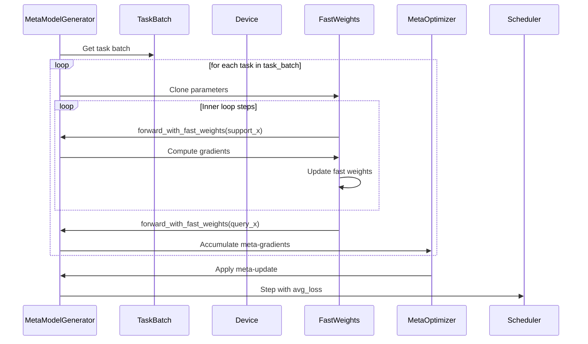
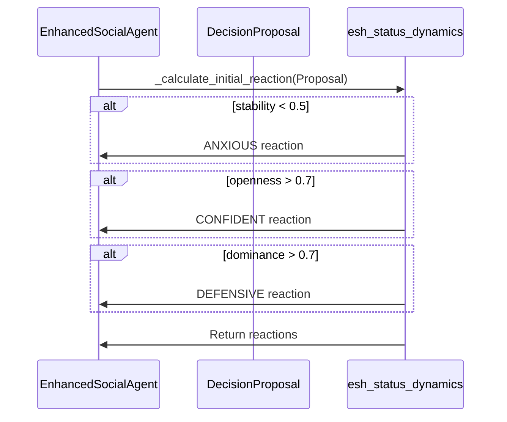
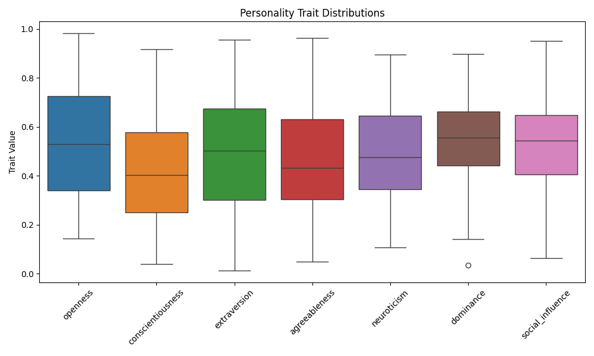

# Friction Flow

## Project Overview

Friction Flow is an advanced Python-based research project aimed at developing a framework for analyzing and simulating complex human behavior and group interaction based on Narrative Field Dynamics. This project leverages AI and machine learning techniques, with a focus on integrating Large Language Models (LLMs) for natural language-based decision making and interactions.

## Key Features

1. **Multi-Agent Systems**: Simulates emergent behavior in complex social systems.
2. **Psychological Modeling**: Incorporates advanced models of individual and group psychology.
3. **LLM Integration**: Utilizes language models for natural language processing and generation.
4. **Distributed Computing**: Employs event-driven architectures for scalable simulations.
5. **Machine Learning Components**: Includes neural networks and other ML techniques for behavior prediction and analysis.

## Technical Stack

 **Python**: Core programming language (version >= 3.12 recommended)

- **PyTorch**: For neural network components and tensor operations
- **Transformers**: For integration with pre-trained language models
- **Ray**: For distributed computing
- **FastAPI**: For service endpoints
- **Redis**: For state management
- **Ollama**: For local LLM integration
- **ChromaDB**: For vector storage and similarity search

## Getting Started

1. Clone the repository:

   ```bash
   git clone https://github.com/leonvanbokhorst/friction-flow
   cd friction-flow
   ```

2. Install dependencies:

   ```bash
   pip install -r requirements.txt
   ```

3. Set up the environment:
   - Ensure you have the necessary language models and embeddings set up as specified in `src/config.py`.

4. Run the simulation:

   ```bash
   python src/nfs_simple_lab_scenario.py
   ```

## Project Structure

- `src/`: Contains the core source code
  - `nfs_story_waves.py`: Simulation components for narrative field dynamics
  - `nfd_three_story_evolve.py`: Enhanced simulation with three interacting stories
  - `nfs_simple_lab_scenario.py`: Example scenario implementation
  - `language_models.py`: Interfaces for various language models
  - `config.py`: Configuration settings
- `tests/`: Unit and integration tests
- `pocs/`: Proof of concept implementations

## Latest Proof of Concept Implementations

### nfs_story_waves.py

This PoC implements a quantum-inspired approach to modeling narrative dynamics. Key features include:

- `NarrativeWave`: Represents stories as quantum wave functions in a narrative field.
- `NarrativeFieldSimulator`: Main class for simulating the evolution of the narrative field.
- Quantum-inspired operations for story interactions and field evolution.
- Pattern detection and emergence analysis.
- Frequency analysis of narrative field dynamics.

This implementation explores the potential of quantum concepts in modeling complex narrative interactions and emergent behaviors.

### nfd_three_story_evolve.py

This PoC focuses on the detailed evolution of three interacting stories within a narrative field. Key components include:

- `Story`: Enhanced representation of individual narratives with emotional states and memory.
- `StoryPhysics`: Simulates the motion and interactions of stories in the narrative field.
- `EnhancedCollectiveStoryEngine`: Manages the collective narrative emerging from story interactions.
- `EnhancedInteractionEngine`: Processes detailed interactions between stories.

This implementation provides a more granular look at story evolution and interaction dynamics.

### nfs_simple_lab_scenario.py

This PoC demonstrates a practical application of the Narrative Field System in a simulated lab environment. Key features include:

- `NarrativeField`: Main class orchestrating the entire system.
- `FieldAnalyzer`: Analyzes the impact of stories on the field state.
- `ResonanceDetector`: Finds similarities between stories.
- `VectorStore`: Manages storage and retrieval of story embeddings.
- A demo scenario simulating events in a research lab, showcasing how the system can model real-world narrative dynamics.

This implementation showcases how the Narrative Field System can be applied to analyze and track narrative dynamics in a specific context.

### model_agnostic_meta_learning.py

This PoC implements a Model-Agnostic Meta-Learning (MAML) approach for rapid adaptation of narrative models to new contexts. Key features include:

- `MetaModelGenerator`: Core meta-learning architecture with:
  - Skip connections for improved gradient flow
  - Adaptive learning rate scheduling
  - Enhanced visualization capabilities
  - Robust error handling and metrics tracking
- Task generation system for synthetic narrative scenarios
- Multi-step adaptation process with gradient clipping
- Comprehensive visualization suite for adaptation analysis
- Built-in feature importance analysis and learning curve tracking



This implementation enables the system to quickly adapt to new narrative contexts with minimal data, making it particularly valuable for modeling emerging story dynamics.

### nfs_bias_research.py

This PoC explores bias detection and evolution in narrative fields through story-based analysis. Key features include:

- Natural story evolution simulation without mechanical state tracking
- Bias pattern detection through narrative field dynamics
- Interactive story generation with LLM integration
- Analysis of character perspective resonances
- Narrative tension and resolution tracking

### bayes_updating.py

This PoC implements Bayesian belief updating for analyzing evolving narratives. Key features include:

- Real-time belief state tracking and visualization
- Evidence-based belief updating
- Confidence level monitoring
- Shift magnitude interpretation
- Comprehensive belief evolution analysis

### poc_story_vs_narrative.py

This PoC investigates the relationship between individual stories and broader narratives. Key features include:

- Story modification through various narrative lenses
- Similarity scoring between original and modified stories
- Category-based story analysis
- Efficient embedding caching
- Detailed modification tracking and logging

### Friction Flow Simulation CLI

The Friction Flow Simulation CLI provides a command-line interface for running and analyzing narrative field simulations. Key features include:

- Interactive simulation configuration
- Real-time event monitoring and logging
- Comprehensive metric tracking:
  - Emotional intensity over time
  - Group cohesion measurements
  - Interaction frequency analysis
- Automated visualization generation:
  - Agent relationship networks
  - Personality trait distributions
  - Social role breakdowns
- Detailed results export in JSON format:
  - Event logs with timestamps
  - Aggregated metrics and summaries
  - Network state snapshots






## Latest Experimental Results

The recent experiments demonstrate several key findings:

1. **Bias Evolution**: The bias research implementation shows how narratives naturally evolve through field interactions, revealing emergent patterns in perspective shifts.

2. **Belief Dynamics**: The Bayesian updating system effectively tracks belief evolution with:
   - Rapid adaptation to new evidence
   - Granular confidence tracking
   - Clear visualization of belief shifts
   - Interpretable magnitude classifications

3. **Story-Narrative Relationship**: The story vs narrative experiments reveal:
   - Quantifiable relationships between individual stories and broader narratives
   - Measurable impact of narrative modifications
   - Consistent patterns in story evolution

These findings contribute to our understanding of narrative field dynamics and provide new tools for analyzing complex social systems.

## Development Guidelines

- Follow PEP 8 style guide and use Black for code formatting.
- Implement type hints as per PEP 484.
- Maintain a minimum of 80% test coverage.
- Adhere to SOLID principles and maintain clear separation of concerns.
- Use meaningful commit messages following the conventional commits format.

## Testing

Run the test suite using pytest:

```bash
pytest tests/
```

## CI/CD

The project uses GitHub Actions for continuous integration. The workflow includes:

- Setting up Python 3.12.6
- Installing dependencies
- Running tests

## Contributing

We welcome contributions to the Friction Flow project. Please read our contributing guidelines before submitting pull requests. Key points:

- No commented-out code in the main branch
- No TODOs in the main branch
- Clear variable and function naming
- Adherence to DRY and SOLID principles

## License

This project is licensed under the Apache License 2.0. See the LICENSE file for details.

## Acknowledgments

This project builds upon research in cognitive science, complex systems theory, social network analysis, and organizational behavior. We acknowledge the contributions of the open-source community and the developers of the libraries and tools used in this project.
